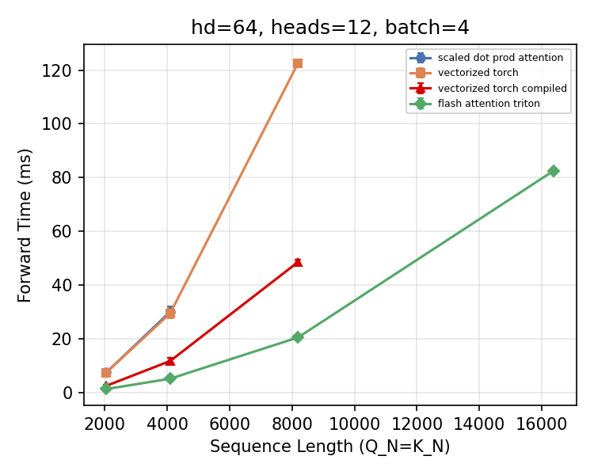
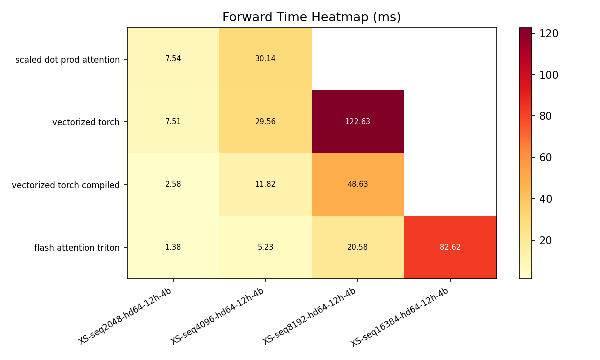
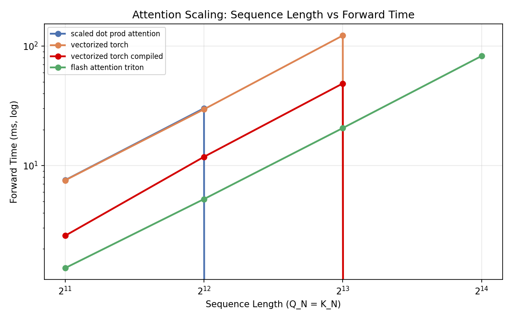

# Attention Forward Benchmark Sweep

| Kernel | Tier | Q_N | K_N | head_dim | heads | batch | avg_ms | std_ms | min_ms |
|--------|------|-----|-----|----------|-------|-------|--------|--------|--------|
| scaled_dot_prod_attention | seq512-hd64-12h-8b | 512 | 512 | 64 | 12 | 8 | 9.2754 | 1.8403 | 3.5937 |
| scaled_dot_prod_attention | seq1024-hd64-12h-8b | 1024 | 1024 | 64 | 12 | 8 | 19.6914 | 8.0418 | 13.2742 |
| scaled_dot_prod_attention | seq2048-hd64-12h-8b | 2048 | 2048 | 64 | 12 | 8 | 58.5596 | 4.4808 | 56.8635 |
| scaled_dot_prod_attention | seq4096-hd64-12h-8b | 4096 | 4096 | 64 | 12 | 8 | 0 | 0 | 0 |
| scaled_dot_prod_attention | seq8192-hd64-12h-8b | 8192 | 8192 | 64 | 12 | 8 | 0 | 0 | 0 |
| scaled_dot_prod_attention | seq16384-hd64-12h-8b | 16384 | 16384 | 64 | 12 | 8 | 0 | 0 | 0 |
| scaled_dot_prod_attention | seq512-hd128-16h-32b | 512 | 512 | 128 | 16 | 32 | 22.0808 | 11.0212 | 18.0933 |
| scaled_dot_prod_attention | seq1024-hd128-16h-32b | 1024 | 1024 | 128 | 16 | 32 | 97.6798 | 32.8425 | 75.0704 |
| scaled_dot_prod_attention | seq2048-hd128-16h-32b | 2048 | 2048 | 128 | 16 | 32 | 0 | 0 | 0 |
| scaled_dot_prod_attention | seq4096-hd128-16h-32b | 4096 | 4096 | 128 | 16 | 32 | 0 | 0 | 0 |
| scaled_dot_prod_attention | seq8192-hd128-16h-32b | 8192 | 8192 | 128 | 16 | 32 | 0 | 0 | 0 |
| scaled_dot_prod_attention | seq16384-hd128-16h-32b | 16384 | 16384 | 128 | 16 | 32 | 0 | 0 | 0 |
| vectorized_torch | seq512-hd64-12h-8b | 512 | 512 | 64 | 12 | 8 | 7.1042 | 1.0818 | 3.7354 |
| vectorized_torch | seq1024-hd64-12h-8b | 1024 | 1024 | 64 | 12 | 8 | 21.0407 | 6.0745 | 11.9808 |
| vectorized_torch | seq2048-hd64-12h-8b | 2048 | 2048 | 64 | 12 | 8 | 65.1321 | 23.492 | 47.0229 |
| vectorized_torch | seq4096-hd64-12h-8b | 4096 | 4096 | 64 | 12 | 8 | 0 | 0 | 0 |
| vectorized_torch | seq8192-hd64-12h-8b | 8192 | 8192 | 64 | 12 | 8 | 0 | 0 | 0 |
| vectorized_torch | seq16384-hd64-12h-8b | 16384 | 16384 | 64 | 12 | 8 | 0 | 0 | 0 |
| vectorized_torch | seq512-hd128-16h-32b | 512 | 512 | 128 | 16 | 32 | 29.5341 | 9.1936 | 16.6072 |
| vectorized_torch | seq1024-hd128-16h-32b | 1024 | 1024 | 128 | 16 | 32 | 108.2373 | 34.1782 | 67.0144 |
| vectorized_torch | seq2048-hd128-16h-32b | 2048 | 2048 | 128 | 16 | 32 | 0 | 0 | 0 |
| vectorized_torch | seq4096-hd128-16h-32b | 4096 | 4096 | 128 | 16 | 32 | 0 | 0 | 0 |
| vectorized_torch | seq8192-hd128-16h-32b | 8192 | 8192 | 128 | 16 | 32 | 0 | 0 | 0 |
| vectorized_torch | seq16384-hd128-16h-32b | 16384 | 16384 | 128 | 16 | 32 | 0 | 0 | 0 |
| vectorized_torch_compiled | seq512-hd64-12h-8b | 512 | 512 | 64 | 12 | 8 | 0.8049 | 0.1217 | 0.783 |
| vectorized_torch_compiled | seq1024-hd64-12h-8b | 1024 | 1024 | 64 | 12 | 8 | 7.6356 | 1.0436 | 4.2424 |
| vectorized_torch_compiled | seq2048-hd64-12h-8b | 2048 | 2048 | 64 | 12 | 8 | 21.4625 | 5.6356 | 12.0098 |
| vectorized_torch_compiled | seq4096-hd64-12h-8b | 4096 | 4096 | 64 | 12 | 8 | 67.3988 | 21.7236 | 45.5284 |
| vectorized_torch_compiled | seq8192-hd64-12h-8b | 8192 | 8192 | 64 | 12 | 8 | 0 | 0 | 0 |
| vectorized_torch_compiled | seq16384-hd64-12h-8b | 16384 | 16384 | 64 | 12 | 8 | 0 | 0 | 0 |
| vectorized_torch_compiled | seq512-hd128-16h-32b | 512 | 512 | 128 | 16 | 32 | 7.7848 | 0.1612 | 7.6793 |
| vectorized_torch_compiled | seq1024-hd128-16h-32b | 1024 | 1024 | 128 | 16 | 32 | 31.8293 | 3.5766 | 30.0544 |
| vectorized_torch_compiled | seq2048-hd128-16h-32b | 2048 | 2048 | 128 | 16 | 32 | 182.952 | 62.3671 | 137.212 |
| vectorized_torch_compiled | seq4096-hd128-16h-32b | 4096 | 4096 | 128 | 16 | 32 | 0 | 0 | 0 |
| vectorized_torch_compiled | seq8192-hd128-16h-32b | 8192 | 8192 | 128 | 16 | 32 | 0 | 0 | 0 |
| vectorized_torch_compiled | seq16384-hd128-16h-32b | 16384 | 16384 | 128 | 16 | 32 | 0 | 0 | 0 |
| flash_attention_triton | seq512-hd64-12h-8b | 512 | 512 | 64 | 12 | 8 | 1.8274 | 7.3627 | 0.7605 |
| flash_attention_triton | seq1024-hd64-12h-8b | 1024 | 1024 | 64 | 12 | 8 | 6.4925 | 1.1074 | 3.3998 |
| flash_attention_triton | seq2048-hd64-12h-8b | 2048 | 2048 | 64 | 12 | 8 | 11.1897 | 0.3333 | 11.0788 |
| flash_attention_triton | seq4096-hd64-12h-8b | 4096 | 4096 | 64 | 12 | 8 | 37.4668 | 0.0075 | 37.4521 |
| flash_attention_triton | seq8192-hd64-12h-8b | 8192 | 8192 | 64 | 12 | 8 | 149.8888 | 0.0147 | 149.86 |
| flash_attention_triton | seq16384-hd64-12h-8b | 16384 | 16384 | 64 | 12 | 8 | 599.0627 | 0.0534 | 599.0042 |
| flash_attention_triton | seq512-hd128-16h-32b | 512 | 512 | 128 | 16 | 32 | 8.1663 | 0.0361 | 8.0727 |
| flash_attention_triton | seq1024-hd128-16h-32b | 1024 | 1024 | 128 | 16 | 32 | 31.4655 | 0.1029 | 31.4182 |
| flash_attention_triton | seq2048-hd128-16h-32b | 2048 | 2048 | 128 | 16 | 32 | 123.5675 | 0.0278 | 123.4891 |
| flash_attention_triton | seq4096-hd128-16h-32b | 4096 | 4096 | 128 | 16 | 32 | 493.0789 | 0.0799 | 492.9344 |
| flash_attention_triton | seq8192-hd128-16h-32b | 8192 | 8192 | 128 | 16 | 32 | 2568.9467 | 764.7284 | 2101.5956 |
| flash_attention_triton | seq16384-hd128-16h-32b | 16384 | 16384 | 128 | 16 | 32 | 7850.0253 | 0.4664 | 7848.7817 |

