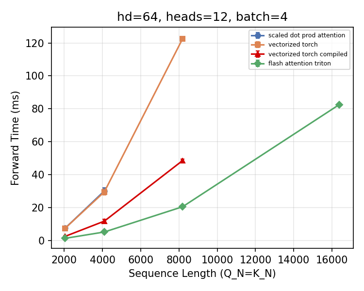
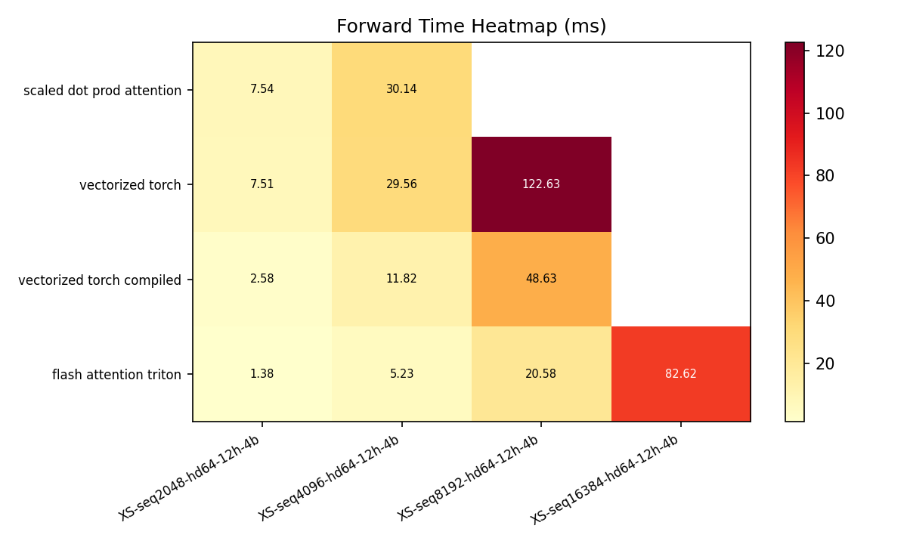
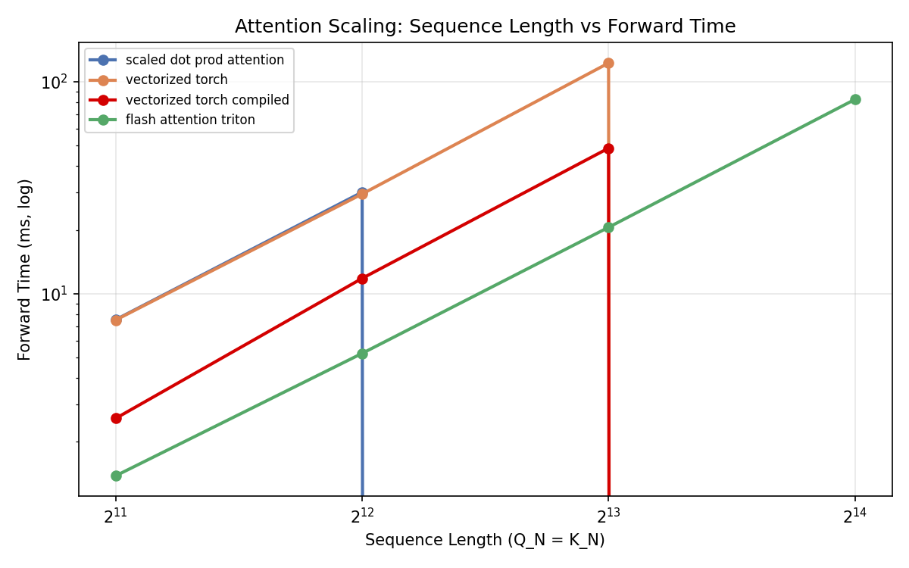

# Attention Forward Benchmark Sweep

| Kernel | Tier | Q_N | K_N | head_dim | heads | batch | avg_ms | std_ms | min_ms | peak_alloc_mb | peak_reserved_mb | peak_alloc_delta_mb |
|--------|------|-----|-----|----------|-------|-------|--------|--------|--------|---------------|------------------|---------------------|
| scaled_dot_prod_attention | XS-seq2048-hd64-12h-4b | 2048 | 2048 | 64 | 12 | 4 | 7.5413 | 0.6815 | 7.2252 | 1581.25 | 1690.00 | 1537.12 |
| scaled_dot_prod_attention | XS-seq4096-hd64-12h-4b | 4096 | 4096 | 64 | 12 | 4 | 30.1449 | 1.8854 | 29.0886 | 6226.38 | 6262.00 | 6146.25 |
| scaled_dot_prod_attention | XS-seq8192-hd64-12h-4b | 8192 | 8192 | 64 | 12 | 4 | 0 | 0 | 0 | N/A | N/A | N/A |
| scaled_dot_prod_attention | XS-seq16384-hd64-12h-4b | 16384 | 16384 | 64 | 12 | 4 | 0 | 0 | 0 | N/A | N/A | N/A |
| vectorized_torch | XS-seq2048-hd64-12h-4b | 2048 | 2048 | 64 | 12 | 4 | 7.5143 | 0.7557 | 7.2702 | 1196.31 | 6262.00 | 1152.19 |
| vectorized_torch | XS-seq4096-hd64-12h-4b | 4096 | 4096 | 64 | 12 | 4 | 29.56 | 1.8576 | 28.7512 | 4688.50 | 4726.00 | 4608.38 |
| vectorized_torch | XS-seq8192-hd64-12h-4b | 8192 | 8192 | 64 | 12 | 4 | 122.6342 | 0.8405 | 121.0075 | 18584.88 | 18598.00 | 18432.75 |
| vectorized_torch | XS-seq16384-hd64-12h-4b | 16384 | 16384 | 64 | 12 | 4 | 0 | 0 | 0 | N/A | N/A | N/A |
| vectorized_torch_compiled | XS-seq2048-hd64-12h-4b | 2048 | 2048 | 64 | 12 | 4 | 2.5804 | 0.2551 | 2.4765 | 440.12 | 6166.00 | 396.00 |
| vectorized_torch_compiled | XS-seq4096-hd64-12h-4b | 4096 | 4096 | 64 | 12 | 4 | 11.8158 | 1.3128 | 11.0539 | 1640.12 | 6166.00 | 1560.00 |
| vectorized_torch_compiled | XS-seq8192-hd64-12h-4b | 8192 | 8192 | 64 | 12 | 4 | 48.6314 | 0.9298 | 46.8152 | 6344.12 | 12310.00 | 6192.00 |
| vectorized_torch_compiled | XS-seq16384-hd64-12h-4b | 16384 | 16384 | 64 | 12 | 4 | 0 | 0 | 0 | N/A | N/A | N/A |
| flash_attention_triton | XS-seq2048-hd64-12h-4b | 2048 | 2048 | 64 | 12 | 4 | 1.3826 | 0.0651 | 1.3115 | 56.31 | 6166.00 | 12.19 |
| flash_attention_triton | XS-seq4096-hd64-12h-4b | 4096 | 4096 | 64 | 12 | 4 | 5.2297 | 0.0679 | 5.1871 | 104.50 | 6166.00 | 24.38 |
| flash_attention_triton | XS-seq8192-hd64-12h-4b | 8192 | 8192 | 64 | 12 | 4 | 20.5773 | 0.2063 | 20.2734 | 200.88 | 6166.00 | 48.75 |
| flash_attention_triton | XS-seq16384-hd64-12h-4b | 16384 | 16384 | 64 | 12 | 4 | 82.6159 | 0.5216 | 81.3568 | 393.62 | 6164.00 | 97.50 |

