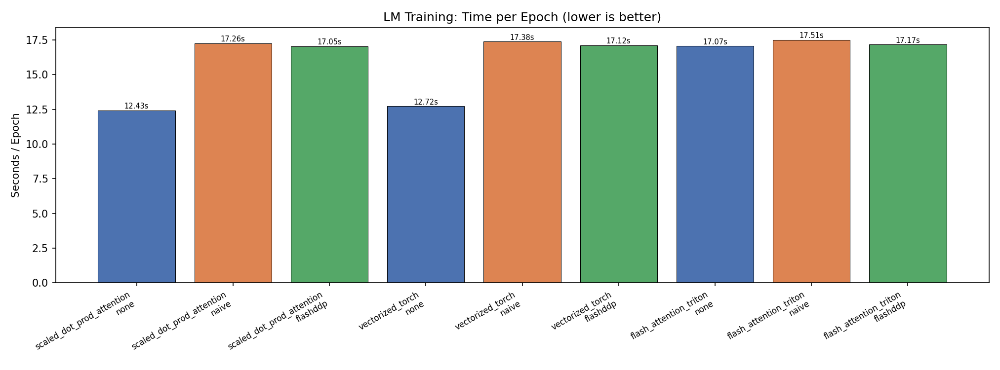
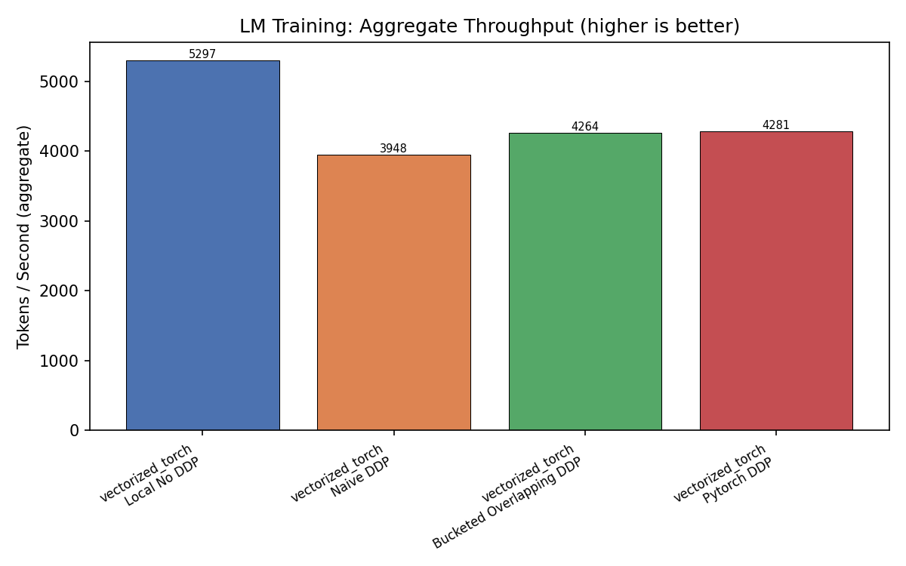
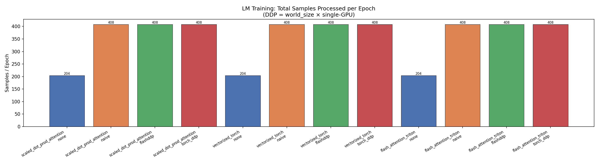

# LM Training Benchmark Matrix

## Design

- **Local batch size** is the **same** across single-GPU and DDP.
- **Steps per epoch** is identical for all configurations.
- DDP therefore processes `world_size ×` more samples per epoch in roughly the same wall-clock time.
- Memory is reported **per-GPU** (worst-case across ranks).

## Results

| Kernel | DDP | GPUs | Epochs | Steps/ep | Global BS | Local BS | Samples/ep | Wall (s) | s/ep | tok/s | Peak GPU MB |
|--------|-----|------|--------|----------|-----------|----------|------------|----------|------|-------|-------------|
| scaled_dot_prod_attention | none | 1 | 5 | 51 | 16 | 16 | 816 | 66.833 | 13.367 | 15628.2 | 1453.4 |
| scaled_dot_prod_attention | naive | 0 | 5 | 51 | 16 | 0 | 0 | 0 | 0 | 0 | 0 |
| scaled_dot_prod_attention | flashddp | 0 | 5 | 51 | 16 | 0 | 0 | 0 | 0 | 0 | 0 |
| scaled_dot_prod_attention | torch_ddp | 0 | 5 | 51 | 16 | 0 | 0 | 0 | 0 | 0 | 0 |
| vectorized_torch | none | 1 | 5 | 51 | 16 | 16 | 816 | 64.159 | 12.832 | 16279.5 | 1436.5 |
| vectorized_torch | naive | 0 | 5 | 51 | 16 | 0 | 0 | 0 | 0 | 0 | 0 |
| vectorized_torch | flashddp | 0 | 5 | 51 | 16 | 0 | 0 | 0 | 0 | 0 | 0 |
| vectorized_torch | torch_ddp | 0 | 5 | 51 | 16 | 0 | 0 | 0 | 0 | 0 | 0 |
| flash_attention_triton | none | 1 | 5 | 51 | 16 | 16 | 816 | 64.457 | 12.891 | 16204.3 | 1421.0 |
| flash_attention_triton | naive | 0 | 5 | 51 | 16 | 0 | 0 | 0 | 0 | 0 | 0 |
| flash_attention_triton | flashddp | 0 | 5 | 51 | 16 | 0 | 0 | 0 | 0 | 0 | 0 |
| flash_attention_triton | torch_ddp | 0 | 5 | 51 | 16 | 0 | 0 | 0 | 0 | 0 | 0 |

## Charts

