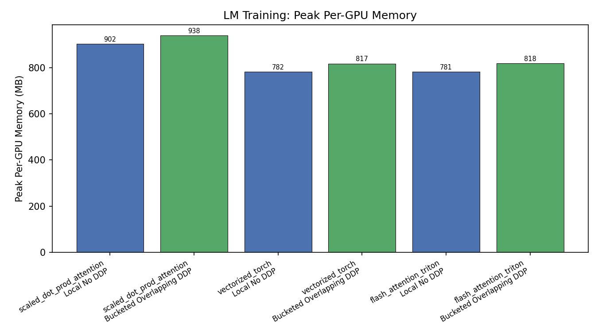
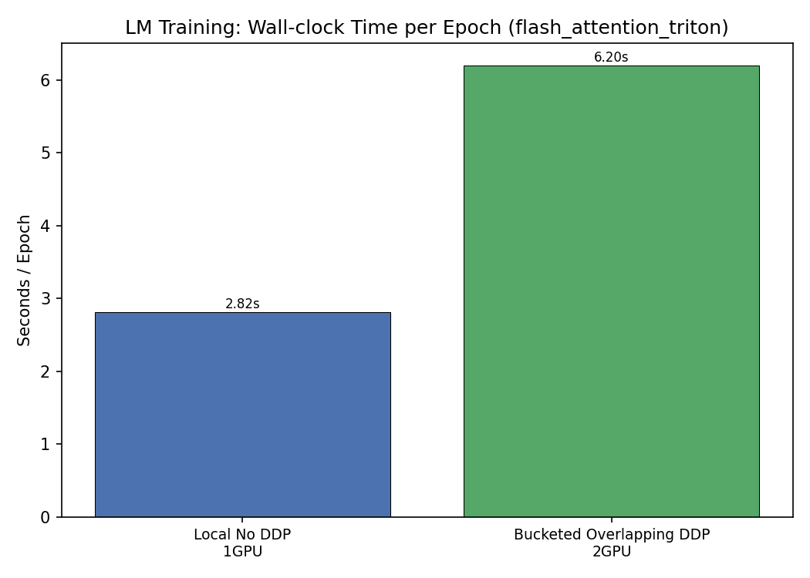
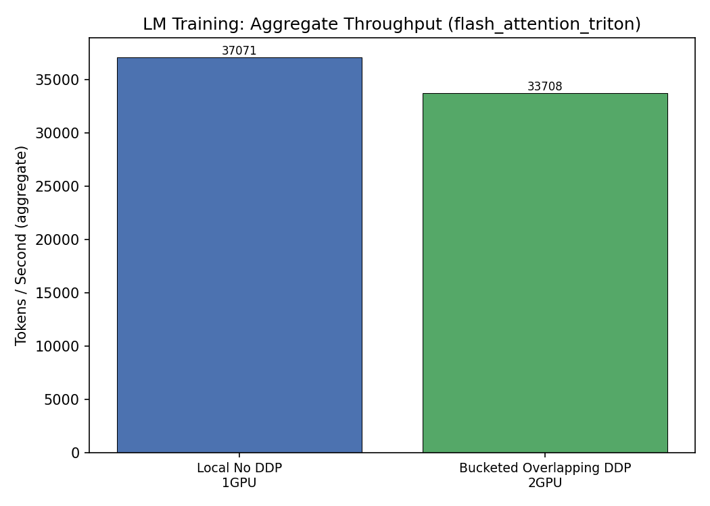
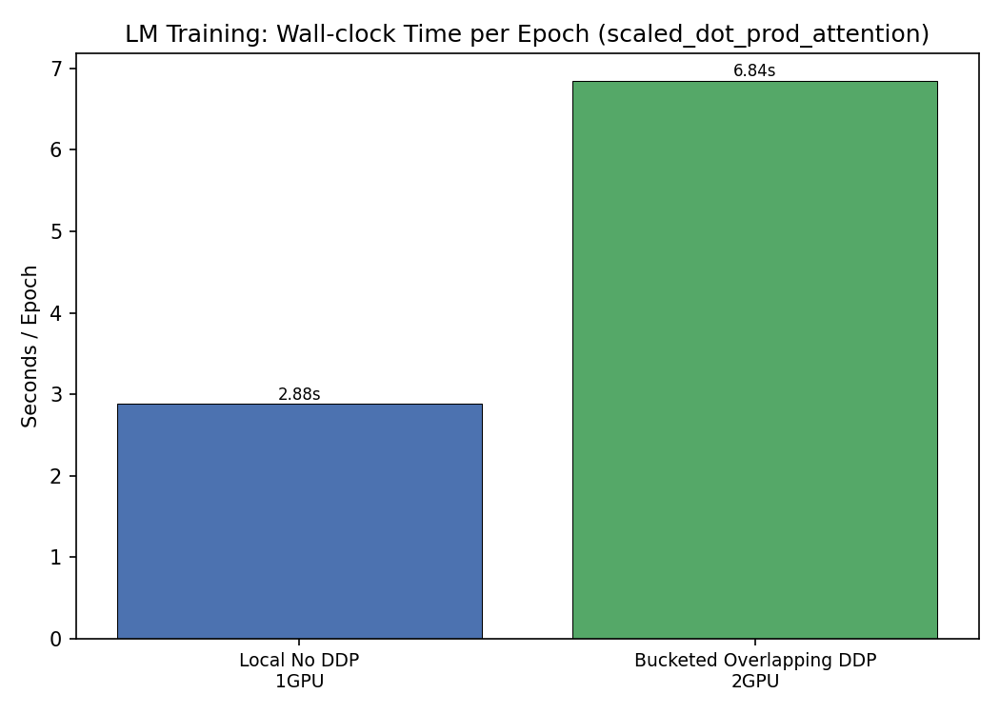
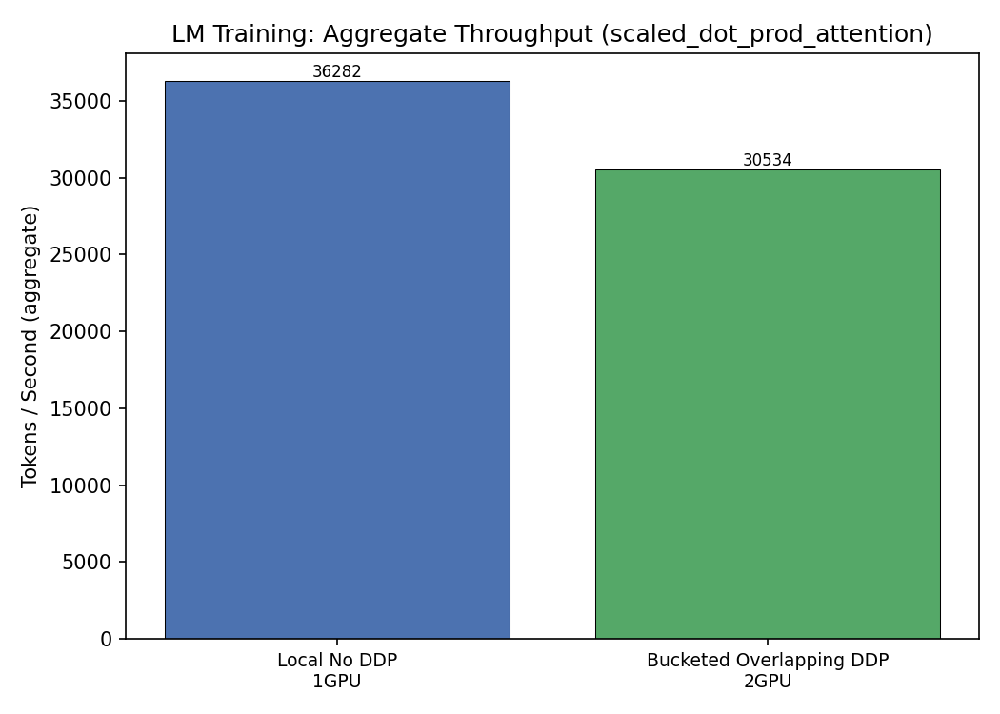
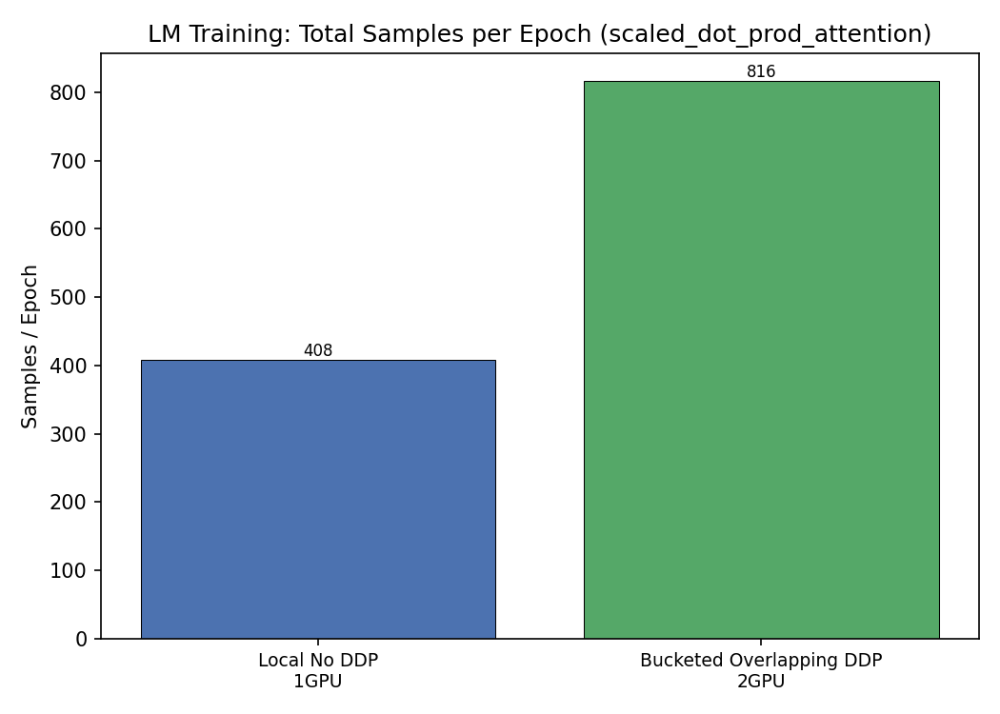
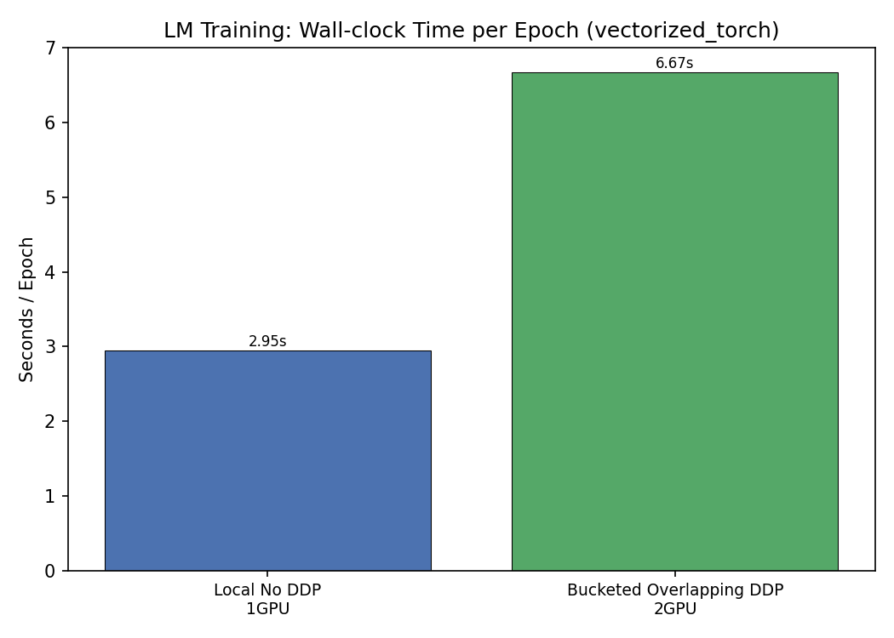
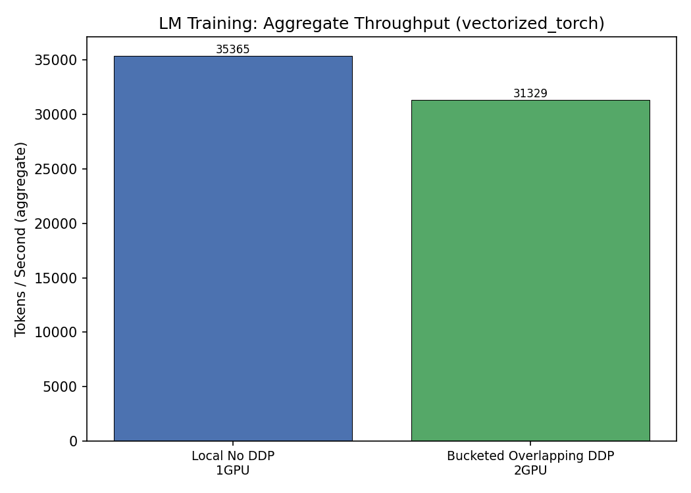
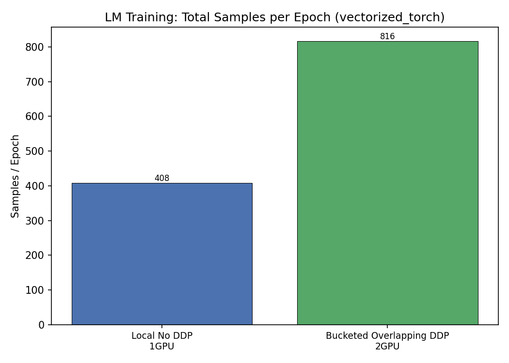
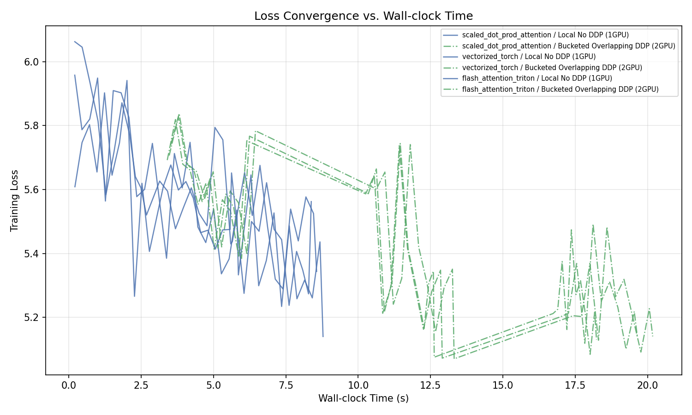

# LM Training Benchmark Matrix

## Design

- **Local batch size** is the **same** across single-GPU and DDP.
- **Steps per epoch** is identical for all configurations.
- DDP therefore processes `world_size ×` more samples per epoch in roughly the same wall-clock time.
- Memory is reported **per-GPU** (worst-case across ranks).

## Results

| Kernel | DDP | GPUs | Epochs | Steps/ep | Global BS | Local BS | Samples/ep | Wall (s) | s/ep | tok/s | Peak GPU MB |
|--------|-----|------|--------|----------|-----------|----------|------------|----------|------|-------|-------------|
| scaled_dot_prod_attention | Bucketed Overlapping DDP | 2 | 3 | 51 | 40 | 20 | 2040 | 134.609 | 44.87 | 23278.1 | 21123.7 |
| scaled_dot_prod_attention | Local No DDP | 1 | 3 | 51 | 20 | 20 | 1020 | 118.56 | 39.52 | 13214.6 | 20624.8 |
| scaled_dot_prod_attention | Naive DDP | 2 | 3 | 51 | 40 | 20 | 2040 | 145.316 | 48.439 | 21562.9 | 20624.8 |
| scaled_dot_prod_attention | Pytorch DDP | 2 | 3 | 51 | 40 | 20 | 2040 | 134.625 | 44.875 | 23275.3 | 21115.1 |
| vectorized_torch | Bucketed Overlapping DDP | 2 | 3 | 51 | 40 | 20 | 2040 | 128.385 | 42.795 | 24406.6 | 15709.7 |
| vectorized_torch | Local No DDP | 1 | 3 | 51 | 20 | 20 | 1020 | 112.37 | 37.457 | 13942.6 | 15213.6 |
| vectorized_torch | Naive DDP | 2 | 3 | 51 | 40 | 20 | 2040 | 138.513 | 46.171 | 22622.0 | 15212.8 |
| vectorized_torch | Pytorch DDP | 2 | 3 | 51 | 40 | 20 | 2040 | 128.408 | 42.803 | 24402.3 | 15701.8 |
| flash_attention_triton | Bucketed Overlapping DDP | 2 | 3 | 51 | 40 | 20 | 2040 | 113.043 | 37.681 | 27719.1 | 15709.4 |
| flash_attention_triton | Local No DDP | 1 | 3 | 51 | 20 | 20 | 1020 | 97.116 | 32.372 | 16132.4 | 15210.6 |
| flash_attention_triton | Naive DDP | 2 | 3 | 51 | 40 | 20 | 2040 | 123.672 | 41.224 | 25336.7 | 15207.3 |
| flash_attention_triton | Pytorch DDP | 2 | 3 | 51 | 40 | 20 | 2040 | 113.151 | 37.717 | 27692.6 | 15700.1 |

## Charts

### flash_attention_triton

### scaled_dot_prod_attention

### vectorized_torch

