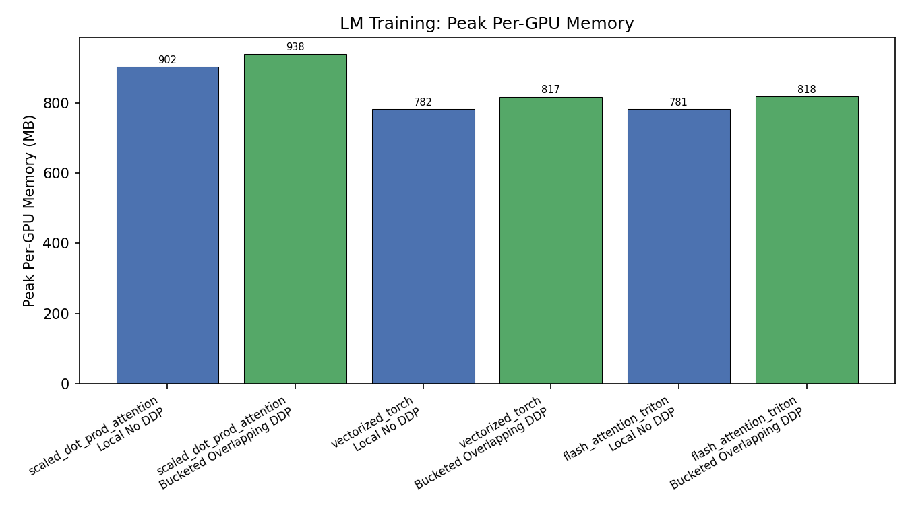
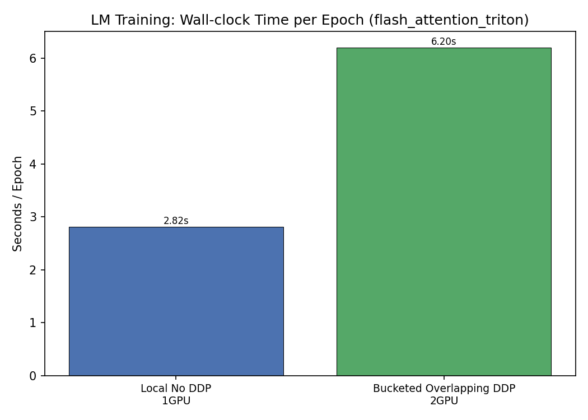
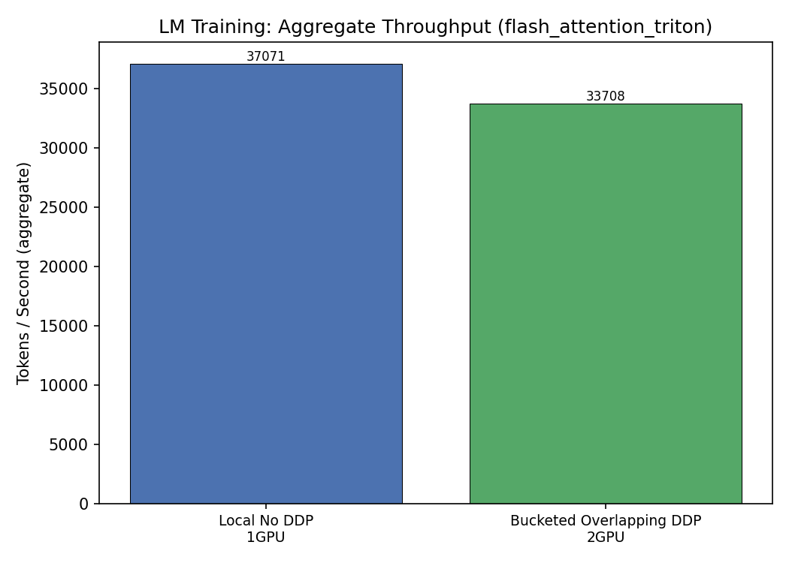
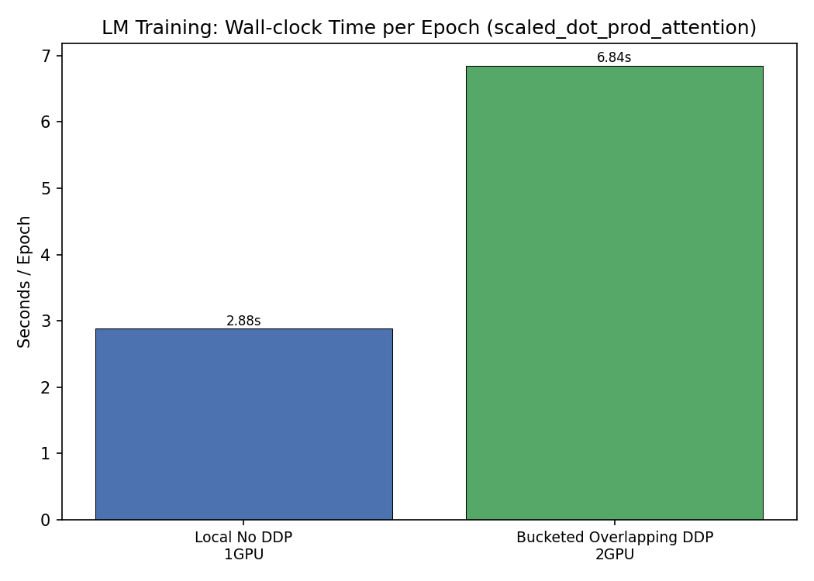
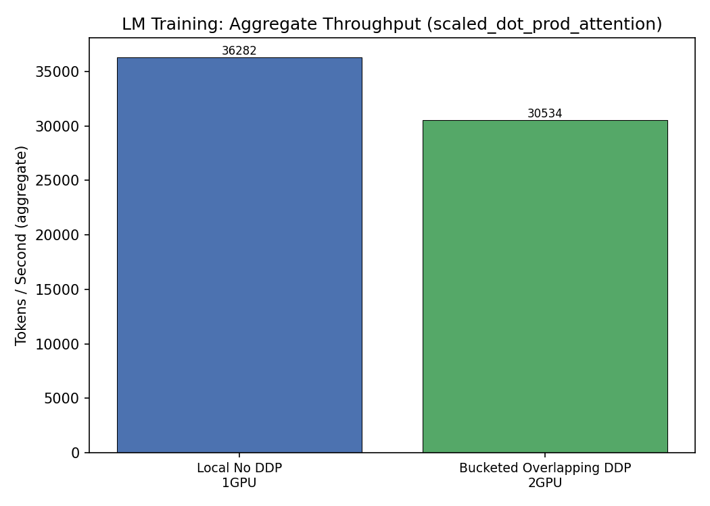
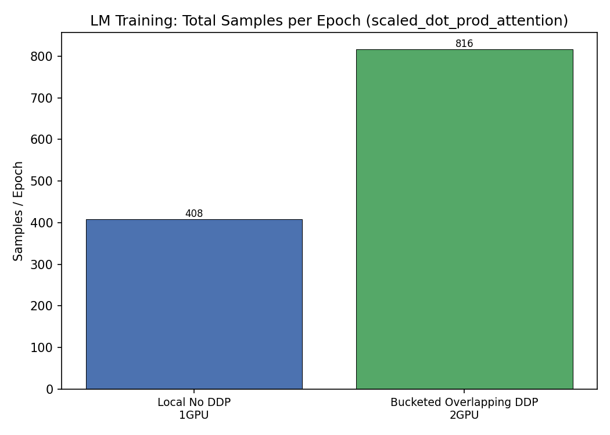
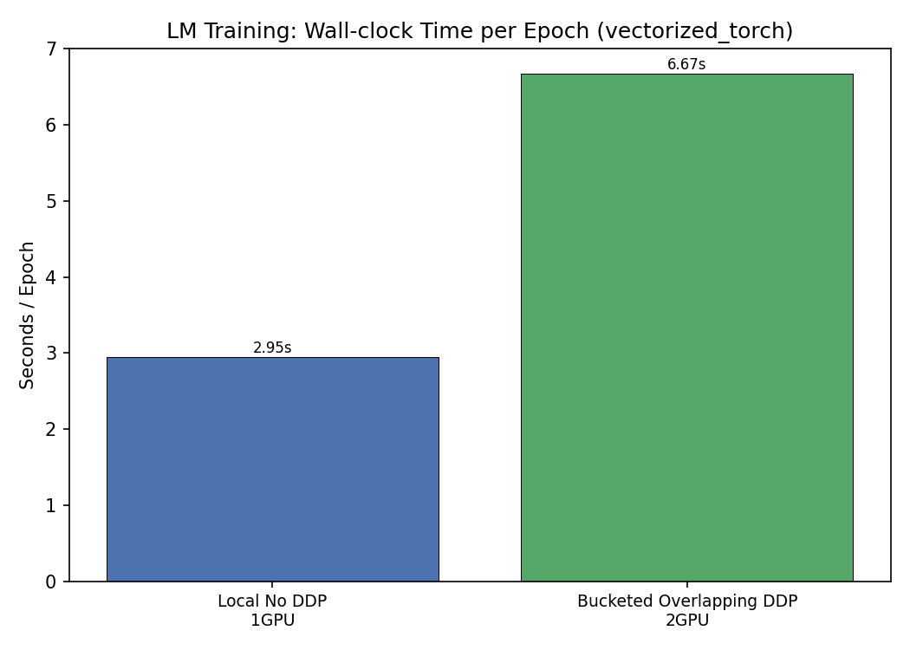
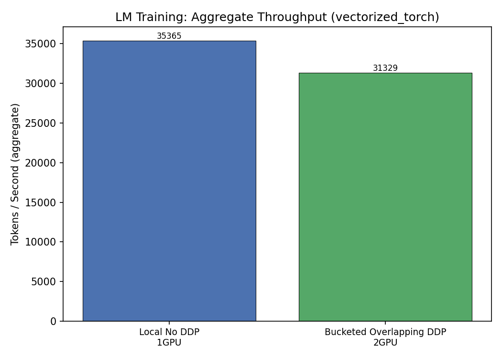
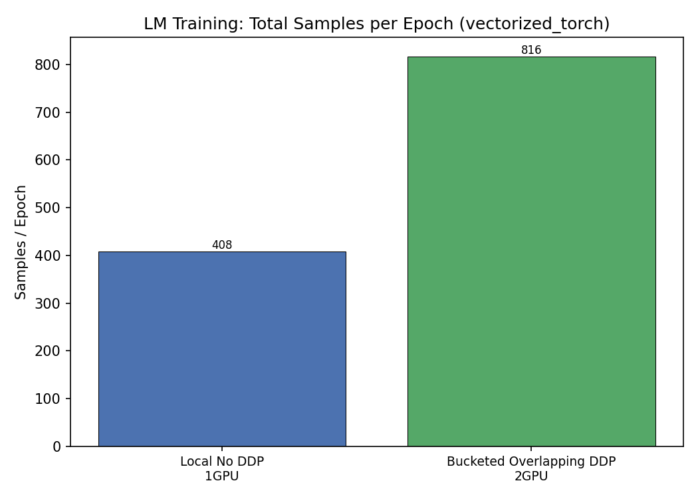
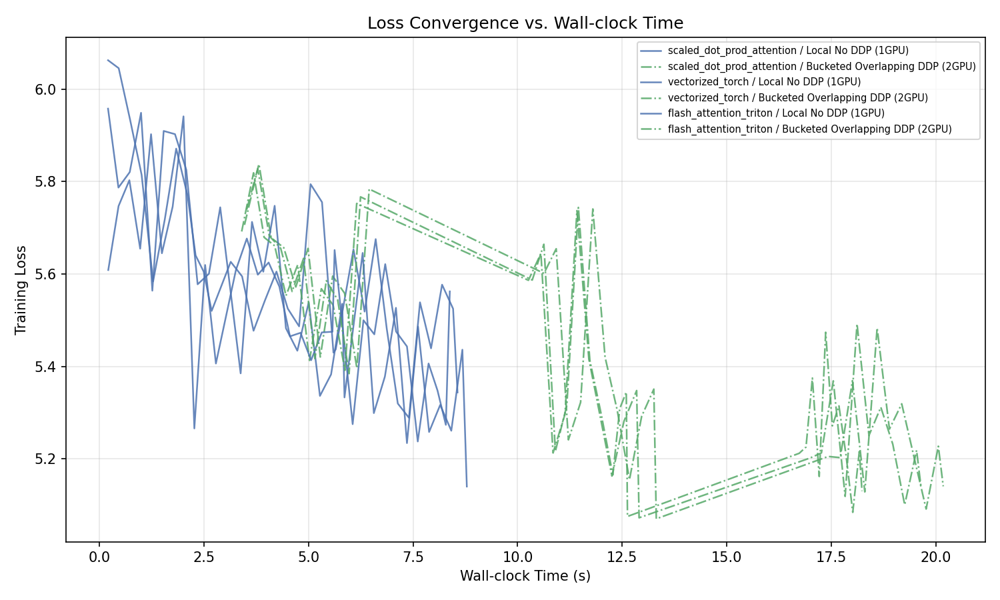

# LM Training Benchmark Matrix

## Design

- **Local batch size** is the **same** across single-GPU and DDP.
- **Steps per epoch** is identical for all configurations.
- DDP therefore processes `world_size ×` more samples per epoch in roughly the same wall-clock time.
- Memory is reported **per-GPU** (worst-case across ranks).

## Results

| Kernel | DDP | GPUs | Epochs | Steps/ep | Global BS | Local BS | Samples/ep | Wall (s) | s/ep | tok/s | Peak GPU MB |
|--------|-----|------|--------|----------|-----------|----------|------------|----------|------|-------|-------------|
| scaled_dot_prod_attention | Local No DDP | 1 | 3 | 51 | 8 | 8 | 408 | 8.636 | 2.879 | 36282.1 | 902.1 |
| scaled_dot_prod_attention | Bucketed Overlapping DDP | 2 | 3 | 51 | 16 | 8 | 816 | 20.525 | 6.842 | 30533.5 | 938.1 |
| vectorized_torch | Local No DDP | 1 | 3 | 51 | 8 | 8 | 408 | 8.86 | 2.953 | 35364.8 | 781.6 |
| vectorized_torch | Bucketed Overlapping DDP | 2 | 3 | 51 | 16 | 8 | 816 | 20.003 | 6.668 | 31329.3 | 817.4 |
| flash_attention_triton | Local No DDP | 1 | 3 | 51 | 8 | 8 | 408 | 8.452 | 2.817 | 37071.3 | 781.2 |
| flash_attention_triton | Bucketed Overlapping DDP | 2 | 3 | 51 | 16 | 8 | 816 | 18.591 | 6.197 | 33708.5 | 817.9 |

## Charts

### flash_attention_triton

### scaled_dot_prod_attention

### vectorized_torch

